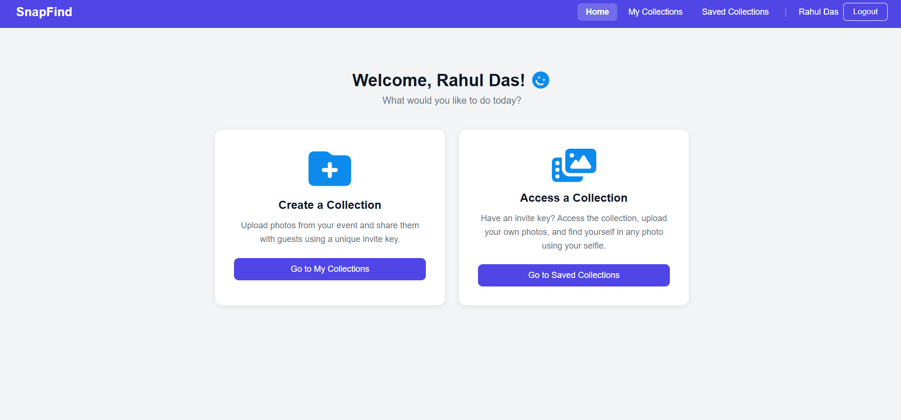
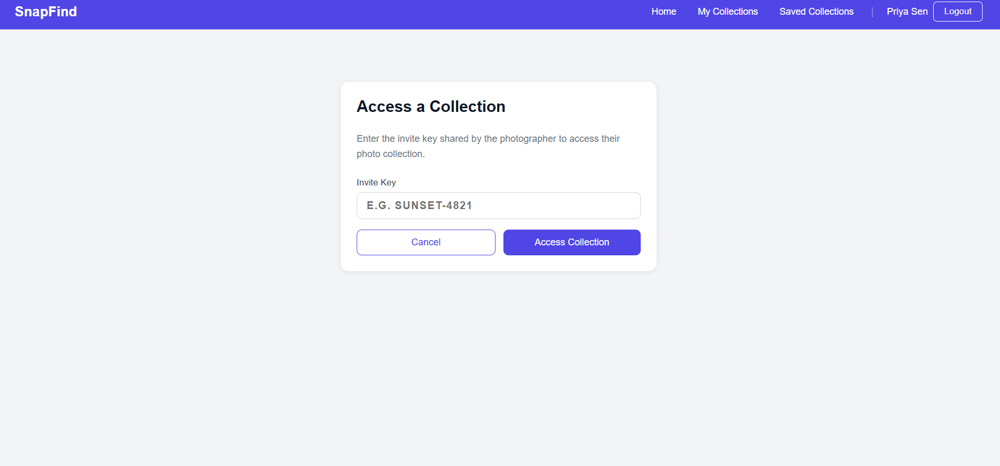
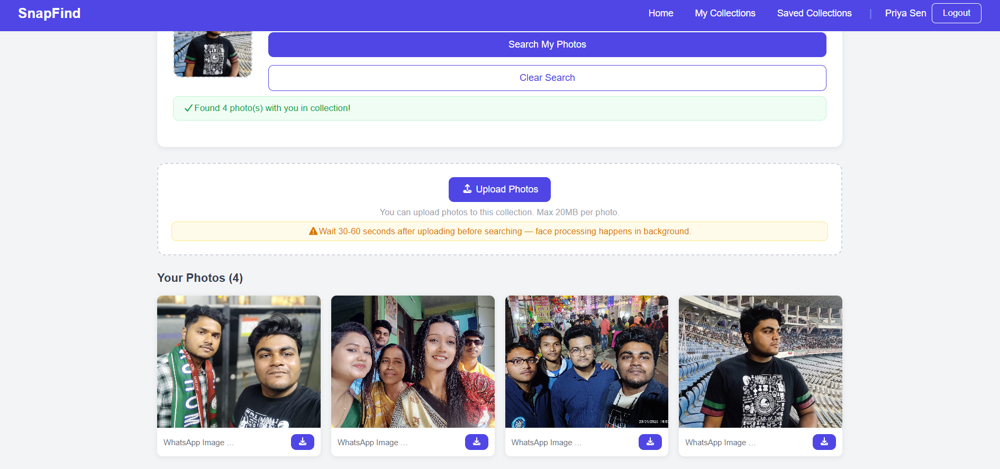

# SnapFind

A web platform for event photo sharing with face recognition. Photographers create collections and share an invite key. Guests use the key to access the collection, upload their own photos, and find every photo featuring them by uploading a single selfie.

---

## The Problem It Solves

At weddings, college events, corporate gatherings, and any large event, photographers or freinds/relatives takes hundreds of photos. Guests have no easy way to find the specific photos they appear in. They either wait for the photographer to manually sort and send photos, or scroll through hundreds of images themselves.

SnapFind eliminates that entirely. A guest accesses a collection uploads one selfie and instantly receives every photo from the event where their face appears.

---

## Screenshots

### Login


### Home


### My Collections (Owner View)


### Create Collection


### Collection Detail with Invite Key and Upload


### Access a Collection via Invite Key


### Saved Collections (Guest View)


### Guest View with Find My Photos Panel


### Selfie Search in Progress


### Search Results


---

## How It Works

1. A user registers and creates a collection. A unique invite key is generated automatically, for example `GARDEN-3097`.
2. The owner uploads photos to the collection. Face embeddings are extracted in the background using DeepFace and Facenet512.
3. The owner shares the invite key with guests via WhatsApp, message, or any channel.
4. Any registered user who receives the key enters it to access the collection. The collection is saved to their Saved Collections list.
5. Inside the collection, a guest can upload a selfie. The system extracts a face embedding from the selfie, runs a vector similarity query against all stored embeddings in that collection, and returns every photo where their face appears.
6. The selfie is never stored. It is written to a temporary file, processed, and deleted immediately.

---

## Tech Stack

| Layer | Technology |
|-------|------------|
| Frontend | React 18, Vite, React Router v6, Axios |
| Backend | Spring Boot 3.2, Java 17, Spring Security, JWT |
| AI Service | Python FastAPI, DeepFace, Facenet512, RetinaFace |
| Database | PostgreSQL 15 with pgvector extension |
| Storage | Local filesystem, S3-ready |

---

## System Architecture

Three independent services communicate over HTTP.

```
React Frontend (port 5173)
        |
        | HTTP + JWT (Authorization header)
        v
Spring Boot Backend (port 8080)
        |                    |
        | JPA / SQL          | HTTP (internal, async)
        v                    v
   PostgreSQL           Python FastAPI (port 8000)
   + pgvector           DeepFace + Facenet512
```

The React frontend communicates only with the Spring Boot backend. The backend handles all business logic, authentication, database access, and file management. It calls the Python service internally for face recognition tasks. The Python service is completely stateless — it receives an image, returns embeddings, and performs no storage or business logic of its own.

---

## Database Design

```
users
  id              BIGSERIAL PRIMARY KEY
  name            VARCHAR NOT NULL
  email           VARCHAR NOT NULL UNIQUE
  password        VARCHAR NOT NULL         -- BCrypt hashed
  created_at      TIMESTAMP

collections
  id              BIGSERIAL PRIMARY KEY
  name            VARCHAR NOT NULL
  unique_key      VARCHAR NOT NULL UNIQUE  -- e.g. GARDEN-3097
  owner_id        BIGINT REFERENCES users(id)
  created_at      TIMESTAMP

photos
  id              BIGSERIAL PRIMARY KEY
  collection_id   BIGINT REFERENCES collections(id) ON DELETE CASCADE
  file_path       VARCHAR NOT NULL         -- UUID-based filename
  original_name   VARCHAR
  uploaded_at     TIMESTAMP

face_embeddings
  id              BIGSERIAL PRIMARY KEY
  photo_id        BIGINT REFERENCES photos(id) ON DELETE CASCADE
  embedding       TEXT NOT NULL            -- 512-dim vector as string

guest_collections
  id              BIGSERIAL PRIMARY KEY
  user_id         BIGINT REFERENCES users(id)
  collection_id   BIGINT REFERENCES collections(id) ON DELETE CASCADE
  accessed_at     TIMESTAMP
```

### Relationships

- One user owns many collections.
- One collection contains many photos.
- One photo has many face embeddings. A group photo with five people produces five rows in face_embeddings, all linked to the same photo_id.
- Many users access many collections through the guest_collections junction table.

### Cascade Rules

- Deleting a collection cascades to delete all its photos, all face embeddings, and all guest_collections rows referencing it.
- A guest removing a collection from their saved list deletes only their own guest_collections row. The collection, its photos, and other guests are completely unaffected.

---

## Face Recognition Flow

### At upload time (asynchronous, background thread)

```
Photo file received by Spring Boot
  -> File saved to disk with UUID filename
  -> Upload API returns 200 immediately (does not wait for AI)
  -> Background thread calls Python POST /extract with image
  -> RetinaFace detects all faces in the photo
  -> Facenet512 generates a 512-dimensional embedding per face
  -> Each embedding saved as a row in face_embeddings table
```

A group photo with three visible faces produces three rows in face_embeddings, all with the same photo_id.

### At search time (synchronous, on demand)

```
Guest uploads selfie
  -> Spring Boot writes selfie to a temp file
  -> Calls Python POST /extract with temp file
  -> Facenet512 generates a 512-dim embedding for the selfie face
  -> Temp file deleted immediately
  -> pgvector cosine similarity query runs:
       SELECT DISTINCT photo_id FROM face_embeddings
       WHERE 1 - (CAST(embedding AS vector) <=> CAST(:queryEmbedding AS vector)) > 0.6
       AND photo_id IN (photos belonging to this collection)
  -> Matched photo records returned to the guest
```

No AI processing happens during search. The entire search operation is a database query against pre-computed vectors.

---

## Access Control

There are no permanent role columns. Access is determined by the relationship between the authenticated user and the collection.

| Action | Who Can Perform It |
|--------|--------------------|
| Register and login | Anyone |
| Create a collection | Any authenticated user |
| Upload photos to a collection | Collection owner and any user who accessed via invite key |
| Delete a photo | Collection owner only |
| Delete a collection | Collection owner only, cascades everything |
| Access a collection via invite key | Any authenticated user |
| Search by selfie | Any user who has accessed the collection |
| Remove a collection from saved list | The guest themselves, soft delete only |

All protected endpoints require a valid JWT in the `Authorization: Bearer <token>` header. Ownership checks are enforced at the service layer. Attempting a restricted action as a non-owner returns HTTP 403.

---

## Key Design Decisions

**Embeddings are computed at upload time, not at search time.**
Face processing is the expensive operation. By doing it once at upload and storing the result, search becomes a fast indexed vector query with no AI involved. This makes search near-instant regardless of collection size.

**Embeddings are stored as TEXT and cast at query time.**
Hibernate's type system does not cleanly support pgvector's native `vector` column type. Embeddings are stored as plain TEXT in the format `[0.123, -0.456, ...]` and cast inside native SQL using `CAST(embedding AS vector)`. This avoids custom type mapping complexity while retaining full pgvector query support.

**Upload returns immediately, embedding extraction is asynchronous.**
The upload endpoint saves the file and returns HTTP 200 without waiting for the Python service. Extraction runs in a Spring `@Async` background thread. The UI shows a warning advising users to wait 30 to 60 seconds before sharing the invite key or searching, to allow background processing to complete.

**Selfies are never persisted.**
The selfie is written to a temporary file only for the duration of the Python API call. It is deleted immediately after the embedding is extracted, before the search query runs. No guest face data is retained anywhere.

**Photo files are served without authentication.**
HTML image tags cannot attach Authorization headers. Photo file endpoints are public but safe because every file is stored under a UUID-based path that cannot be guessed or enumerated. There are no sequential IDs or predictable filenames in file URLs.

---

## Running Locally

### Prerequisites

- Java 17 or higher
- Node.js 18 or higher
- Python 3.11
- PostgreSQL 15 with the pgvector extension

### Database setup

```sql
CREATE DATABASE snapfind;
\c snapfind
CREATE EXTENSION IF NOT EXISTS vector;
```

### Backend

```bash
cd backend
./mvnw spring-boot:run
```

Runs at `http://localhost:8080`.

### Face recognition service

```bash
cd face-service
python -m venv venv

# Windows
venv\Scripts\activate

# macOS / Linux
source venv/bin/activate

pip install -r requirements.txt
uvicorn main:app --host 0.0.0.0 --port 8000 --reload
```

Runs at `http://localhost:8000`.

### Frontend

```bash
cd frontend
npm install
npm run dev
```

Runs at `http://localhost:5173`.

---

## Project Structure

```
snapfind/
├── backend/
│   └── src/main/java/com/snapfind/backend/
│       ├── config/         JWT filter, Security config, CORS config
│       ├── controller/     Auth, Collection, Photo, Search REST endpoints
│       ├── service/        Business logic, async embedding extraction
│       ├── repository/     JPA repositories, native vector similarity queries
│       ├── entity/         User, Collection, Photo, FaceEmbedding, GuestCollection
│       ├── dto/            Request and response objects
│       └── exception/      Global exception handler
├── face-service/
│   ├── main.py             FastAPI app with /extract endpoint
│   └── requirements.txt    DeepFace, FastAPI, Uvicorn, Pillow
├── frontend/
│   └── src/
│       ├── pages/          Login, Register, Home, MyCollections, SavedCollections, Gallery
│       ├── components/     Navbar, PhotoCard, ProtectedRoute
│       ├── context/        AuthContext for JWT state management
│       ├── api/            Axios instance with request interceptors
│       └── styles/         Global CSS
├── docs/
│   └── screenshots/
└── README.md
```

---

## API Overview

### Authentication

| Method | Endpoint | Description |
|--------|----------|-------------|
| POST | `/api/auth/register` | Create a new account |
| POST | `/api/auth/login` | Login and receive JWT |

### Collections

| Method | Endpoint | Description |
|--------|----------|-------------|
| GET | `/api/collections/my` | Get collections owned by the authenticated user |
| POST | `/api/collections` | Create a new collection |
| DELETE | `/api/collections/{id}` | Delete a collection and all its data |
| POST | `/api/collections/access` | Access a collection using an invite key |
| GET | `/api/collections/saved` | Get collections the user has accessed as a guest |
| DELETE | `/api/collections/saved/{id}` | Remove a collection from the saved list |

### Photos

| Method | Endpoint | Description |
|--------|----------|-------------|
| GET | `/api/photos/collection/{collectionId}` | List all photos in a collection |
| POST | `/api/photos/upload/{collectionId}` | Upload one or more photos |
| DELETE | `/api/photos/{photoId}` | Delete a photo (owner only) |
| GET | `/api/photos/file/{filename}` | Serve a photo file (public) |

### Face Search

| Method | Endpoint | Description |
|--------|----------|-------------|
| POST | `/api/search/{collectionId}` | Upload selfie, returns matched photos |

---

## Environment Configuration

### Backend `application.properties`

```properties
spring.datasource.url=jdbc:postgresql://localhost:5432/snapfind
spring.datasource.username=postgres
spring.datasource.password=yourpassword

spring.jpa.hibernate.ddl-auto=update
spring.jpa.show-sql=false

jwt.secret=your-secret-key-here
jwt.expiration=86400000

face.service.url=http://localhost:8000

spring.servlet.multipart.max-file-size=20MB
spring.servlet.multipart.max-request-size=100MB

file.upload-dir=uploads/
```

---

## Known Considerations

- Face recognition accuracy depends on photo quality and lighting. Clear, front-facing selfies produce the best results.
- Processing time for embedding extraction scales with the number of faces in a photo. Large group photos take longer to process in the background.
- The 30 to 60 second wait advisory after upload is to allow background embedding threads to complete before search is attempted.
- The cosine similarity threshold of 0.6 is a balanced default. Lowering it increases recall but may produce false matches. Raising it improves precision at the cost of missing some true matches.
- The current storage implementation uses the local filesystem. Migrating to S3 or any object storage requires only changing the file read and write logic in the photo service.

---

## Future Roadmap

- WebSocket notification to the owner when all embeddings in a batch finish processing
- ZIP bulk download for all photos returned from a face search
- QR code generation for invite keys for easy sharing at events
- GPU acceleration for the Python face recognition service
- Collection expiry dates set by the owner
- React Native mobile application

---

## License

This project is intended for educational and personal use. Ensure compliance with applicable privacy laws before deploying with real user data, particularly regarding biometric data processing and storage.

---

## Author
Utshav